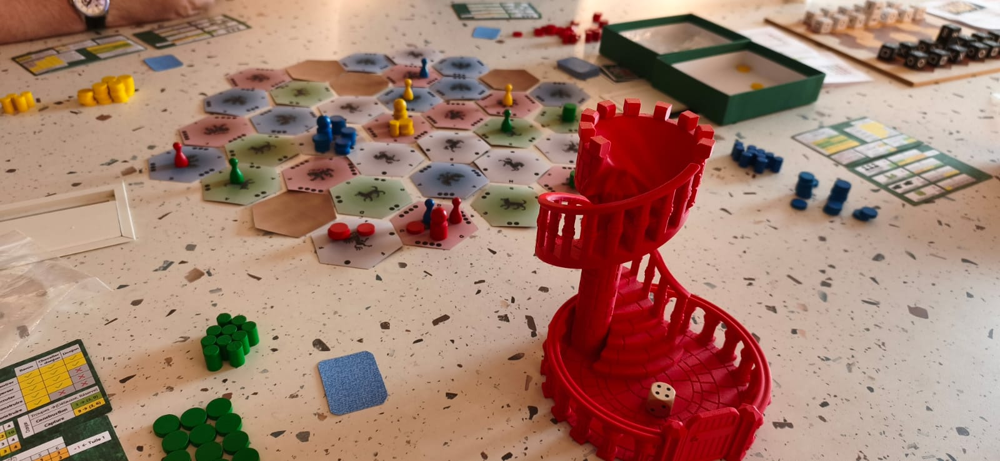
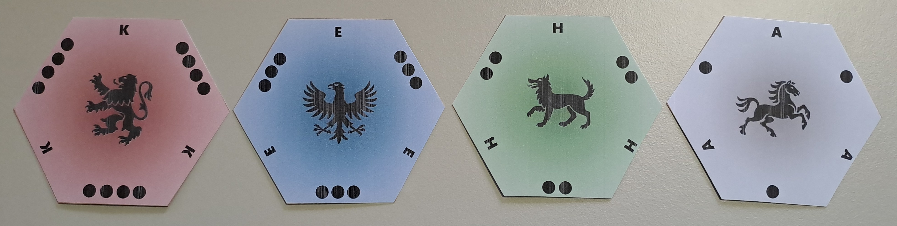
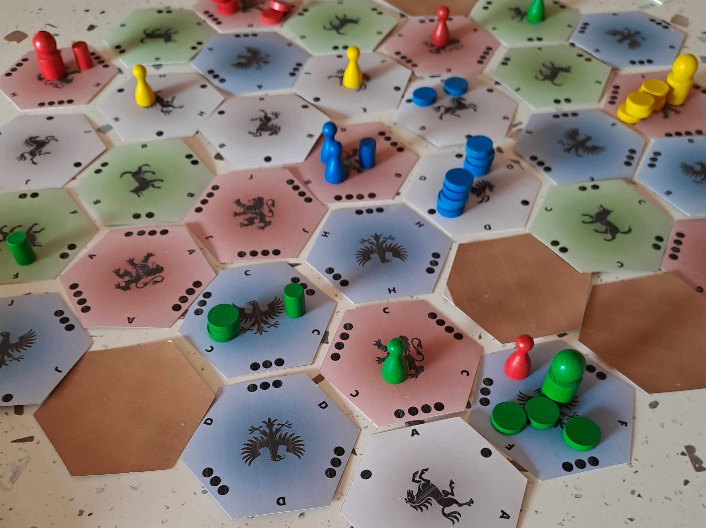
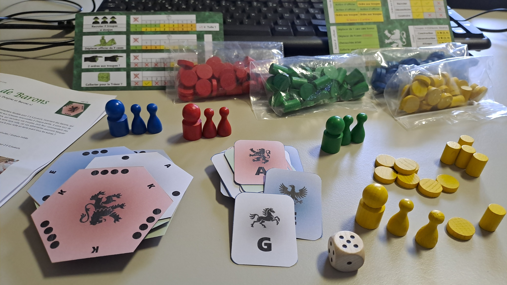
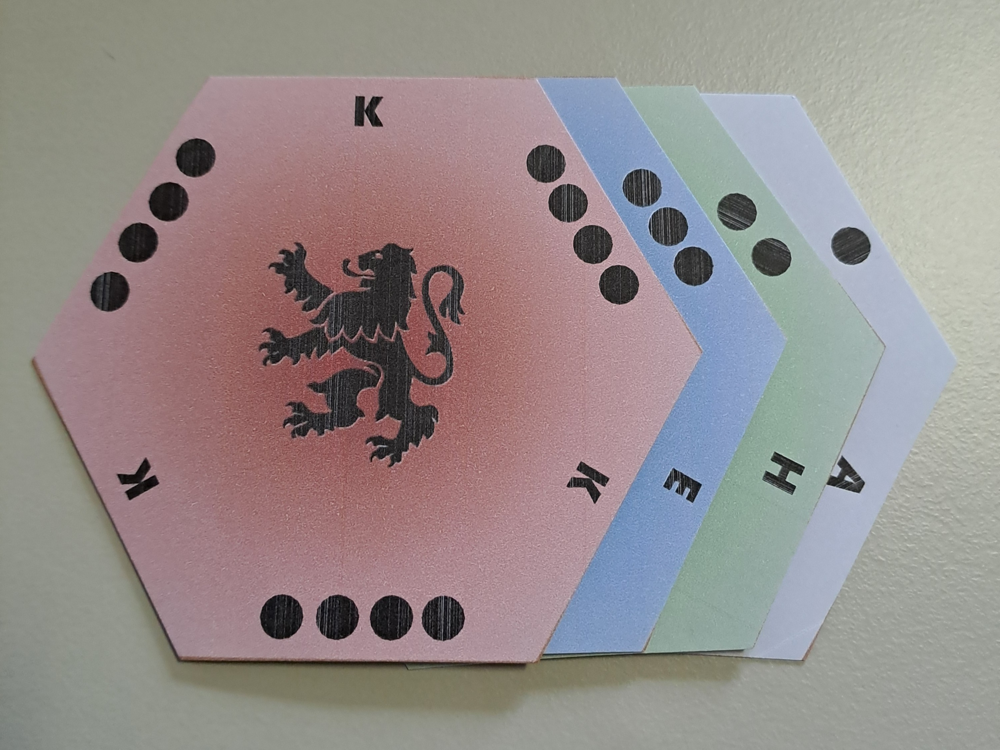
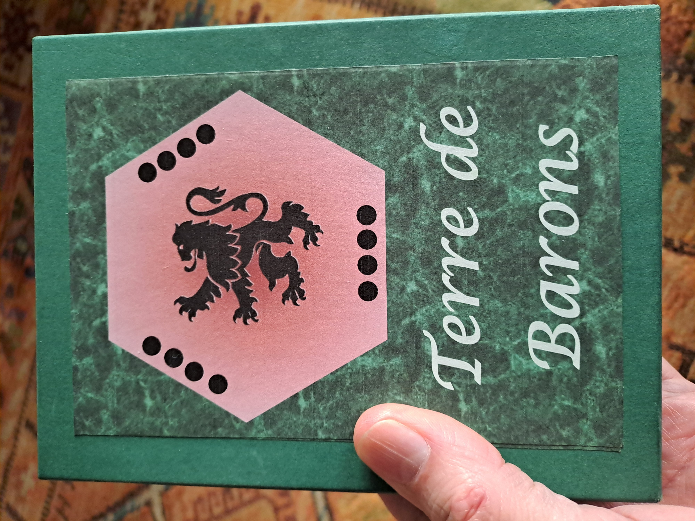

# Terre de Barons : les règles du jeu
Le jeu « Terre de Barons » (anciennement « Donjons et Barons ») est un jeu de plateau d’atmosphère féodale pour 2 à 4 joueurs, incarnant des barons, qui s’opposent dans la construction de donjons sur des terres aux richesses renouvelées à chaque partie. 

A votre tour de jeu, vous déplacez vos officiers, un baron et deux chevaliers, qui recrutent vos troupes, puis leur commandent des déplacements et des constructions de donjons. 

La course à la terre sera rude, car vos adversaires pourront bloquer vos ordres ou attaquer vos troupes et vos donjons. Quel baron sera le plus riche en terre avant tous les autres ?

Terre de Barons est un wargame léger dans lequel le hasard s'applique aux ressources du tour de jeu, mais pas aux batailles.

Voir situations de jeu sur les [photos](#Photos) ci-dessous. Voir les fichiers "[Word](https://github.com/LucasBorboleta/Donjons-et-Barons/blob/main/Donjons-et-Barons-les-regles.docx)" ou "[PDF](https://github.com/LucasBorboleta/Donjons-et-Barons/blob/main/Donjons-et-Barons-les-regles.pdf)" pour les **règles détaillées** (also available in "[English](https://github.com/LucasBorboleta/Donjons-et-Barons/blob/main/Donjons-and-Barons-the-rules.pdf)").

Voir la playlist **YouTube** [Terre-de-Barons](https://www.youtube.com/playlist?list=PLui_B_YF7szOCI3bv5orTqHsCmiYBMkyT) (et aussi [Donjons-et-Barons](https://www.youtube.com/playlist?list=PLui_B_YF7szNSGDArisupSQ0EuoTJJkg8)) pour des vidéos sur les **règles** et des **parties** filmées.

Ce projet est en phase avancée de test.

[Playtest "Land of Barons" on Tabletopia](https://tabletopia.com/games/land-of-barons-4zur8p/680x340) 

## Informations générales

Nombre de joueurs : 2 à 4 / Age minimum : 10 ans / Durée de partie : 45 minutes / Joueurs initiés

Type de jeu : tactique, stratégique, combo-conquête-combat

Deux façons de stopper et de gagner la partie / aléa limité au bonus d'action / combats sans aléa / terrain mis en place aléatoirement / tensions entre construction, attaque, course, blocage / plusieurs stratégies possibles / ambiance duel cérébral à 2 joueurs, mais aussi ambiance à rebondissements à 3 et 4 joueurs au gré des alliances éphémères

 *Terre de Barons (anciennement Donjons et Barons) , règles d'un jeu pour 2 à 4 joueurs.
Copyright (C) 2023 [lucas.borboleta@free.fr](mailto:lucas.borboleta@free.fr) ; licence Creative Commons BY-NC-SA*

## Anecdote
Le concept du choix d'un ordre de dispersion/concentration/recrutement depuis une tuile de commandement est inspiré du jeu « [Realm](https://boardgamegeek.com/boardgame/3024/realm) » (1974) de Philip Orbanes. Le concept de blocage des communications avec le commandement est inspiré du « [Jeu de la Guerre](https://fr.wikipedia.org/wiki/Le_Jeu_de_la_guerre_(livre)) » (1965) de Guy Debord.

## Photos

