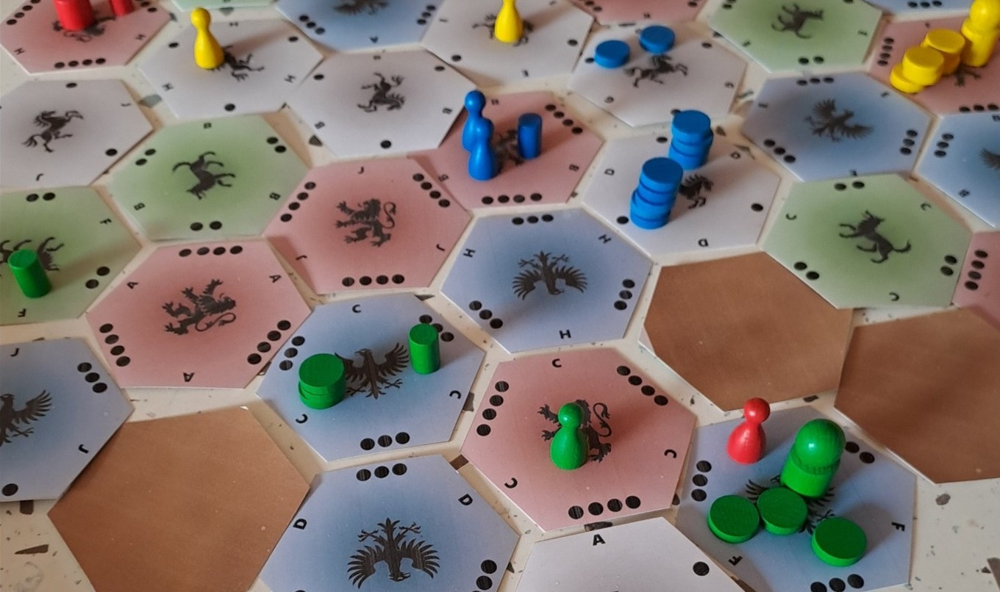
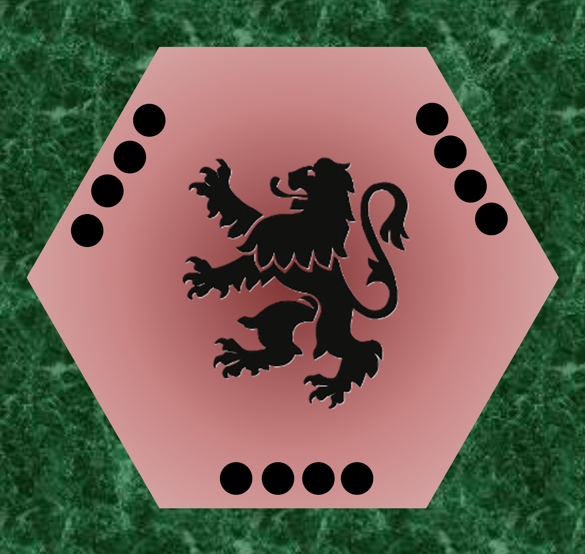

# Terre de Barons : les règles du jeu (rulebook)
Dans **Terre de Barons**, vous incarnez un **Seigneur Suzerain** engagé dans la conquête de provinces morcelées. Sur un domaine qui se dessine à chaque bataille, vos ordres sont dictés par la gestion de vos cartes.

Vos **Seigneurs** — votre **Baron** et ses **Chevaliers Liges** — parcourent le terrain pour assurer la logistique de votre armée : ils lèvent des **Troupes**, déplacent vos bataillons et ordonnent la construction de **Donjons**, piliers de votre conquête.

Les manœuvres de Troupes peuvent provoquer des affrontements décisifs, tandis que le placement stratégique de vos Chevaliers permet de verrouiller les positions adverses et de limiter les ordres de vos rivaux.

Qui s’imposera comme le Baron le plus puissant ? Êtes-vous prêt pour une aventure épique où se mêlent stratégie, tactique et prise de risque ?

---

In **The Land of Barons**, you play as a **Liege Lord** engaged in the conquest of fractured provinces. Across a domain that takes shape with every battle, your orders are driven by the strategic management of your cards.

Your Lords — your **Baron** and his **Liege Knights** — roam the land to manage your army's logistics: they recruit **Troops**, move your battalions, and order the construction of **Keeps**, the pillars of your conquest.

Troop maneuvers can spark decisive battles, while the strategic placement of your Knights allows you to lock down enemy positions and restrict your rivals' orders.

Who will emerge as the most powerful Baron? Are you ready for an epic adventure where strategy, tactics, and risk-taking collide?

Voir situations de jeu sur les [photos](#Photos) ci-dessous. Voir cette [vidéo](https://youtu.be/a39c2wJPorA)" pour un **aperçu des règles en 5 mn**. Voir le fichier "[PDF](./Terre-de-Barons-les-regles.pdf)" pour les **règles détaillées**. Read the "[PDF](./Land-of-Barons-the-Rules.pdf)" **rulebook** in **English**

Ce projet est en phase avancée de test.

[Playtest "Land of Barons" on Tabletopia](https://tabletopia.com/games/land-of-barons-fdva5w/680x340) (setup français + English setup)

## Informations générales

| **Nombre de joueurs** | 2 à 4           |      |      | **Genre**  |      |      | **Mécaniques**         |
| --------------------- | --------------- | ---- | ---- | ---------- | ---- | ---- | ---------------------- |
| **Âge**               | 10 ans et plus  |      |      | Conquête   |      |      | Contrôle de zones      |
| **Durée**             | 60 minutes      |      |      | Tactique   |      |      | Chaîne de commandement |
| **Public**            | Joueurs initiés |      |      | Logistique |      |      | Gestion de main        |

 *Terre de Barons (anciennement Donjons et Barons) , règles d'un jeu pour 2 à 4 joueurs.
Copyright (C) 2023 [lucas.borboleta@free.fr](mailto:lucas.borboleta@free.fr) ; licence Creative Commons BY-NC-SA*

## Anecdote
Le concept du choix d'un ordre de dispersion/concentration/recrutement depuis une tuile de commandement est inspiré du jeu « [Realm](https://boardgamegeek.com/boardgame/3024/realm) » (1974) de Philip Orbanes. Le concept de blocage des communications avec le commandement est inspiré du « [Jeu de la Guerre](https://fr.wikipedia.org/wiki/Le_Jeu_de_la_guerre_(livre)) » (1965) de Guy Debord.

## Photos

