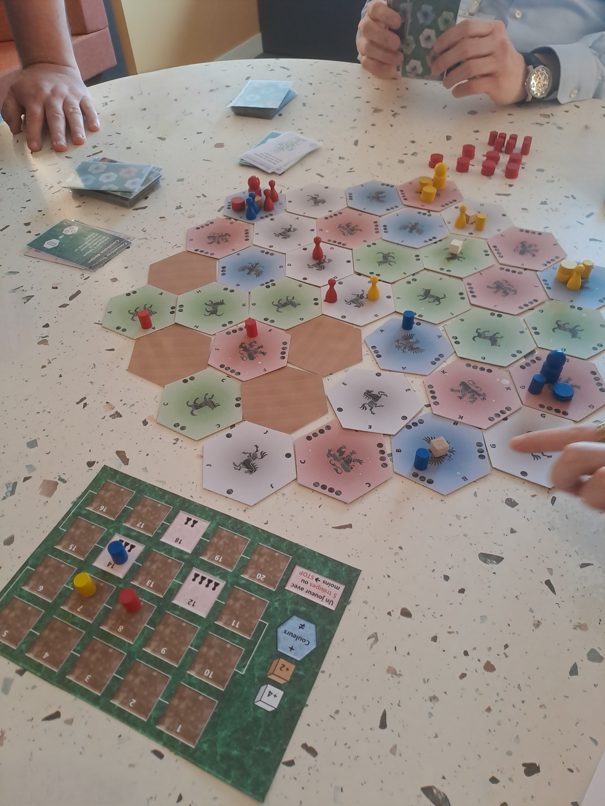
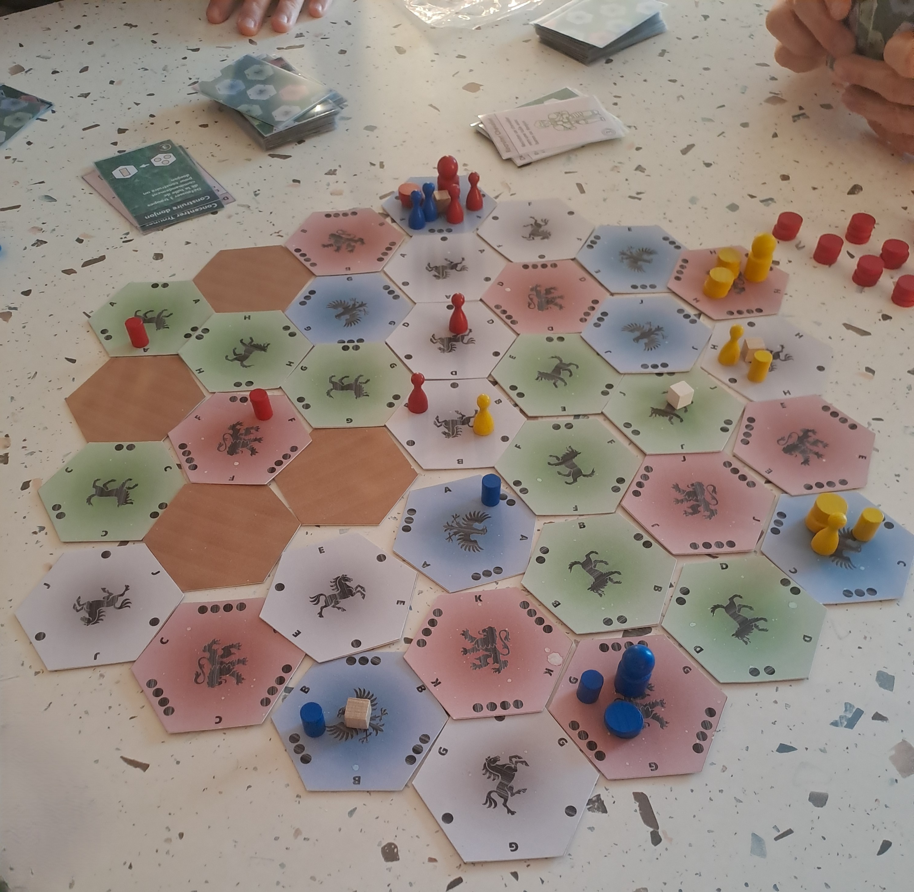
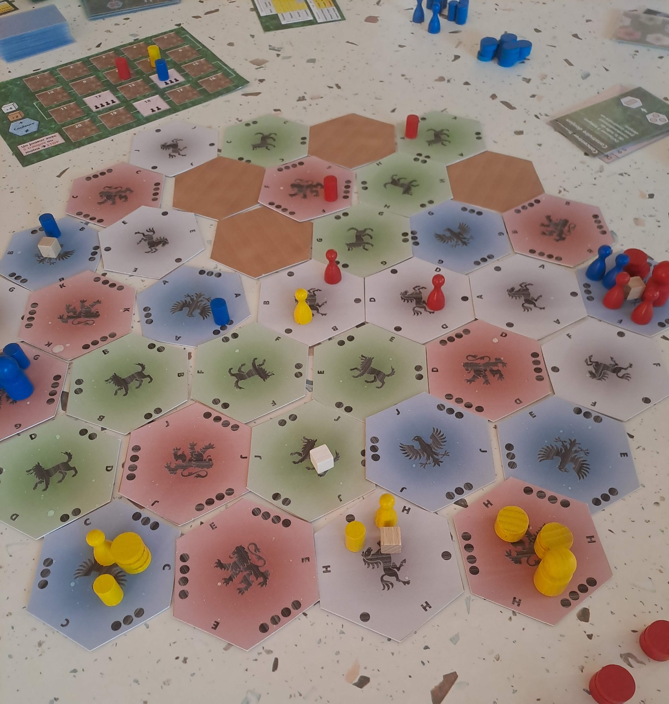

# Terre de Barons : les règles du jeu
Dans Terre de Barons, vous incarnez un stratège médiéval engagé dans la **conquête de terres disputées**. Sur un plateau modulaire renouvelé à chaque partie, vos actions sont dictées par la **gestion des cartes de votre deck**.

Vos Officiers — un **Baron** et ses **Chevaliers** — parcourent le terrain pour assurer la **logistique** de votre armée : ils recrutent, déplacent vos **Troupes** et ordonnent la construction des **Donjons**, piliers de votre conquête. Les manœuvres de Troupes peuvent provoquer des affrontements décisifs, tandis que le placement stratégique de vos Chevaliers permet de bloquer ou de limiter les ordres adverses.

Qui s’imposera comme le Baron le plus puissant ? Êtes-vous prêt pour une aventure épique où se mêlent **stratégie**, **tactique** et **prise de risque** ?

Voir situations de jeu sur les [photos](#Photos) ci-dessous. Voir le fichier "[PDF](./Terre-de-Barons-les-regles.pdf)" pour les **règles détaillées**.

Ce projet est en phase avancée de test.

[Playtest "Land of Barons" on Tabletopia](https://tabletopia.com/games/land-of-barons-4zur8p/680x340) 

## Informations générales

| **Nombre de joueurs** | 2 à 4           |      |      | **Genre**  |      |      | **Mécaniques**         |
| --------------------- | --------------- | ---- | ---- | ---------- | ---- | ---- | ---------------------- |
| **Âge**               | 10 ans et plus  |      |      | Conquête   |      |      | Contrôle de zones      |
| **Durée**             | 60 minutes      |      |      | Tactique   |      |      | Chaîne de commandement |
| **Public**            | Joueurs initiés |      |      | Logistique |      |      | Gestion de main        |

 *Terre de Barons (anciennement Donjons et Barons) , règles d'un jeu pour 2 à 4 joueurs.
Copyright (C) 2023 [lucas.borboleta@free.fr](mailto:lucas.borboleta@free.fr) ; licence Creative Commons BY-NC-SA*

## Anecdote
Le concept du choix d'un ordre de dispersion/concentration/recrutement depuis une tuile de commandement est inspiré du jeu « [Realm](https://boardgamegeek.com/boardgame/3024/realm) » (1974) de Philip Orbanes. Le concept de blocage des communications avec le commandement est inspiré du « [Jeu de la Guerre](https://fr.wikipedia.org/wiki/Le_Jeu_de_la_guerre_(livre)) » (1965) de Guy Debord.

## Photos

